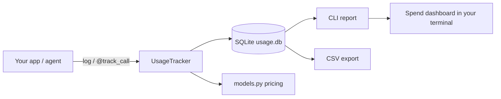

# llm-usage-meter

Track **token usage, latency, and spend** for every LLM call your app or agent makes — with zero API keys and zero cloud services. Everything lands in a local SQLite database; a CLI prints spend reports.

Built for developers who run agents in loops and want to answer *"how much did that run cost?"* without a vendor dashboard.

## Why

- Agent loops burn tokens silently — 40 tool calls at 8k context each is not the same as one chat.
- Prompt caching changes the math (cached input is ~10x cheaper on most providers); this tracks cached vs. fresh input separately.
- Provider-agnostic: OpenAI, Anthropic, Gemini, xAI, DeepSeek — anything that reports token counts.

## Install

```bash
git clone https://github.com/sulaimanvesal/llm-usage-meter.git
cd llm-usage-meter
pip install -r requirements.txt   # pytest only
```

No dependencies for the library itself — it uses the Python standard library.

## Quick start

```python
from usage_meter import UsageTracker

tracker = UsageTracker()  # ~/.llm-usage-meter/usage.db

# Manual logging (grab usage from any provider's response)
tracker.log(
    model="claude-sonnet-4-5",
    provider="anthropic",
    prompt_tokens=12_400,
    completion_tokens=860,
    cached_tokens=10_000,   # cached input billed at the cheaper rate
    latency_ms=2340,
    tag="support-bot",
)

# Or decorate any function returning (result, usage_dict)
from usage_meter import track_call

@track_call(tracker, model="gpt-4o-mini", tag="agent-loop", provider="openai")
def agent_step(state):
    response = client.chat.completions.create(model="gpt-4o-mini", messages=state)
    u = response.usage
    return response, {
        "prompt_tokens": u.prompt_tokens,
        "completion_tokens": u.completion_tokens,
        "cached_tokens": getattr(u.prompt_tokens_details, "cached_tokens", 0),
    }
```

## CLI reports

```bash
python -m usage_meter.cli --days 7            # last week's spend
python -m usage_meter.cli --tag agent-loop    # one workload only
python -m usage_meter.cli --recent 10         # last 10 calls
```

Sample output:

```
=== LLM usage report (last 7d) ===
calls:            128
prompt tokens:    1,204,300
cached tokens:    980,000
completion tokens:41,220
total cost:       $0.6124
avg latency:      1840 ms
max latency:      41000 ms

--- by model ---
claude-sonnet-4-5      calls=12   in=148,800 out=10,320 cost=$0.1876
o3                     calls=4    in=35,600  out=16,800 cost=$0.2056
gpt-4o-mini            calls=112  in=1,019,900 out=14,100 cost=$0.2192
```

Also available: `tracker.export_csv("usage.csv")` and `tracker.clear()`.

## Custom pricing

Prices are approximate list prices baked into `usage_meter/models.py`. Override them:

```python
tracker = UsageTracker(pricing={"my-model": {"in": 0.001, "out": 0.002, "cached_in": 0.0001}})
```

Unknown models are tracked with `$0.00` cost — no crash, no guess.

## Architecture



- `usage_meter/tracker.py` — `UsageTracker` (SQLite store, summaries, filters) and the `@track_call` decorator.
- `usage_meter/models.py` — per-1K-token pricing tables, cache-aware cost math.
- `usage_meter/cli.py` — `python -m usage_meter.cli` report command.
- `demo.py` — zero-API-key demo that simulates an agent's calls and prints a report.

## Tests

```bash
pytest -q
```

## License

MIT
